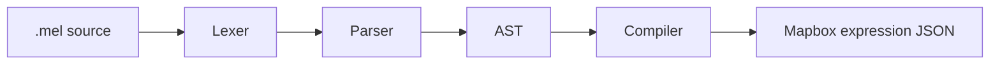

<p align="center">
  
</p>

# mapbox-expr-lang

[](https://www.npmjs.com/package/mapbox-expr-lang)
[](LICENSE)

A small language that compiles to [Mapbox GL JS](https://docs.mapbox.com/style-spec/reference/expressions/) style expressions.

Write readable code, get back the JSON expression Mapbox expects.

```
var speed = get("speed")
var type = get("type")

if speed > 80 and type == "highway" then
  "red"
else
  "gray"
```

compiles to:

```json
[
  "let",
  "speed",
  ["get", "speed"],
  "type",
  ["get", "type"],
  ["case", ["all", [">", ["var", "speed"], 80], ["==", ["var", "type"], "highway"]], "red", "gray"]
]
```

## Install

```bash
npm install mapbox-expr-lang
```

## Usage

```ts
import { compile } from "mapbox-expr-lang";

compile('get("speed") > 80');
// [">", ["get", "speed"], 80]
```

That's the whole API: one function. It throws on invalid source, with a
message that says exactly what's wrong (`'and' requires a boolean operand,
but this is a number`, `Unknown function "typof"`, `Variable "x" is not
defined`, ...) — never an internal detail you can't act on.

## How it works



## Docs

- **[Language guide](https://amine-a11.github.io/mapbox-expr-lang/guide/)** — a short tour of the language
- **[Operator reference](https://amine-a11.github.io/mapbox-expr-lang/operators/)** — every operator, linked to its page on [docs.mapbox.com](https://docs.mapbox.com/style-spec/reference/expressions/)
- **[Full grammar](grammar.md)** — the formal EBNF grammar

## License

[MIT](LICENSE)
