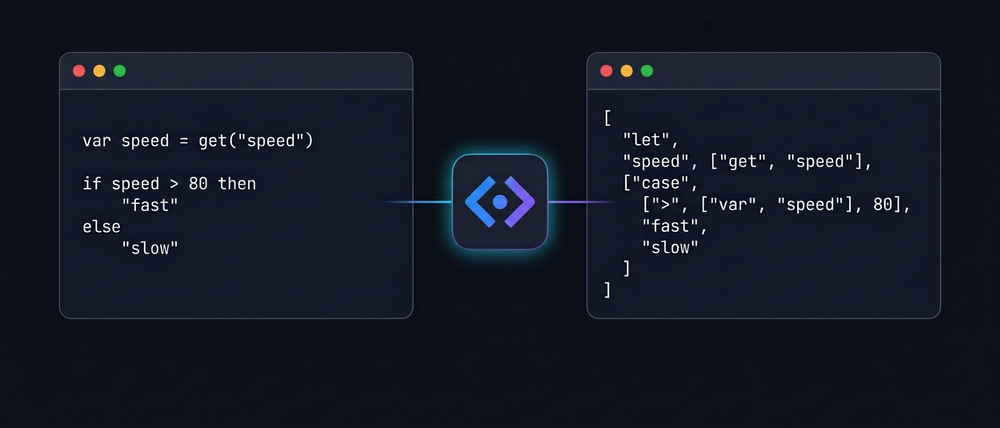

# mapbox-expr-lang

A small language that compiles to [Mapbox GL JS](https://docs.mapbox.com/style-spec/reference/expressions/) style expressions.

Write readable code, get back the JSON expression Mapbox expects.

```
var speed = get("speed")
var type = get("type")

if speed > 80 and type == "highway" then
  "red"
else
  "gray"
```

compiles to:

```json
[
  "let",
  "speed",
  ["get", "speed"],
  "type",
  ["get", "type"],
  ["case", ["all", [">", ["var", "speed"], 80], ["==", ["var", "type"], "highway"]], "red", "gray"]
]
```

## Install

```bash
npm install mapbox-expr-lang
```

```ts
import { compile } from "mapbox-expr-lang";

compile('get("speed") > 80');
// [">", ["get", "speed"], 80]
```

That's the whole API: one function, `compile(source)`. It throws on invalid
source with a message that says exactly what's wrong, never an internal
detail you can't act on.

## Where to go next

- **[Playground](playground.html)** — type source, see the compiled expression live, no install
- **[Language guide](guide/)** — learn the language, with an example for every feature
- **[Operator reference](operators/)** — every operator this language supports, linked to its page on [docs.mapbox.com](https://docs.mapbox.com/style-spec/reference/expressions/)
- **[Source on GitHub](https://github.com/amine-a11/mapbox-expr-lang)**
